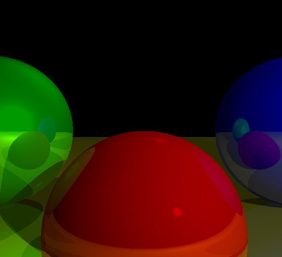

# Simple Raytracer

A simple raytracer in C, using only the Win32 API. Implements the pseudo-raytracer as illustrated in the first chapter of [Computer Graphics from Scratch](https://www.gabrielgambetta.com/computer-graphics-from-scratch/).

## Functionality
- [X] - **Basic raytracing** - Implementing core raytracing algorithms & tracing a sample scene composed of spheres.
- [X] - **Light** - Implementing light sources & light illumination into the sample scene.
- [X] - **Shadows and Reflection** - Implements the interactions between the light sources and scene objects.
- [X] - **Extending the Raytracer** - Arbitrary camera positioning, performance, subsampling etc.

### Extra functionality 
- [X] - Support for triangles.
- [X] - Shows elapsed time for rendering the scene.
- [X] - Right click shows canvas & screen coordinate of the mouse.

## Configuration
Refer to `ConfigureScene()` in `main.c` for a sample configuration. 

Please keep in mind that I use Y-up coordinate system for the scene, and that the canvas coordinate's origin is located at the center of the screen (`PutPixel()` automatically converts from canvas to screen coordinates).

### Important constants/defines
main.c:
- `const int WINDOW_HEIGHT = 600;` - defines the height of the rendering area
- `const int WINDOW_WIDTH = 600;` - defines the width of the rendering area
raytracer.c:
- `const int SHOW_ELAPSED = 1;` - when rendering is completed, show elapsed time in ms.
- `const int RT_DEPTH = 3;` - recursion depth of the raytracer for the reflection calculation
- `const int SUBSAMPLE_FACTOR = 0;` - subsampling factor (factor of 2 means 4x subsampling, 3 means 8x and so on); 0 or 1 for disable
- `#define EPSILON			 0.1` - the smallest possible number before 0; used for many computations. You may want to tweak this if you are placing objects too close to one another. Too low epsilon will cause tearing in far-distance objects because of the precision. Change with caution.
